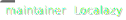

<div align="center">

[](https://localazy.com)

### 📦 `@localazy/api-client`

Node.js client for the [Localazy API](https://localazy.com/docs/api), providing a simple and type-safe way to integrate localization features into your JavaScript and TypeScript projects.

[](https://www.npmjs.com/package/@localazy/api-client)
[](https://github.com/localazy)
[](https://github.com/localazy/api-client/blob/main/LICENSE)<br>
[](https://github.com/localazy/api-client/actions)
[](https://bundlephobia.com/package/@localazy/api-client)

</div>

## 🔧 Install

```bash
npm install @localazy/api-client
# or you can use yarn or pnpm
```

## 🚀 Usage

###### ESM

```javascript
import { ApiClient } from '@localazy/api-client';

const json = { en: { tooltip: 'Elegant unicorn' } }; // Get text to translate.

const api = new ApiClient({ authToken: 'your-project-token' }); // Create Api client.
const project = await api.projects.first(); // Get Localazy project.
const file = await api.import.json({ project, json }); // Import source keys.
const fr = await api.export.json({ project, file, langs: ['fr'] }); // Export translated keys.

console.log(fr); // 🦄 { fr: { tooltip: 'Licorne élégante' } }
```

###### TypeScript

```javascript
import { ApiClient, Project, I18nJson, Locales } from '@localazy/api-client';

const json: I18nJson = { en: { tooltip: 'Elegant unicorn' } };

const api: ApiClient = new ApiClient({ authToken: 'your-project-token' });
const project: Project = await api.projects.first();
const file: File = await api.import.json({ project, json: json });
const fr: I18nJson = await api.export.json({ project, file, langs: [Locales.FRENCH] });
```

## 🔐 Project Token

You can obtain the project token at https://localazy.com/developer/tokens.

The project token is permitted to read and write to the single project.

## 📚 Documentation

- [API Client reference](docs/api-client-reference.md)
- [Examples](examples)
- [Migration guide from `ts-api@1.x.x` to `api-client@2.0.0`](docs/migration-guide-from-v1-to-v2.md)
- [Changelog](CHANGELOG.md)

## ℹ️ Links

- [Localazy API documentation](https://localazy.com/docs/api)
- [Articles about the Localazy API](https://localazy.com/tags/api)

## 🛟 Support

Join the [Localazy Discussion Forum](https://discuss.localazy.com/) to discuss all things localization.

If you encounter any problems or have questions, you can use our forum, GitHub issues or contact us at
team@localazy.com.

## ❤️ Localazy Ecosystem

Check out other npm packages from Localazy:

|                                                                                                                                  | NPM package                                                                      | Description                                  |
| :------------------------------------------------------------------------------------------------------------------------------- | -------------------------------------------------------------------------------- | -------------------------------------------- |
|           | [@localazy/cli](https://www.npmjs.com/package/@localazy/cli)                     | Localazy CLI tool.                           |
|  | [@localazy/api-client](https://www.npmjs.com/package/@localazy/api-client)       | Localazy API client.                         |
|     | [@localazy/languages](https://www.npmjs.com/package/@localazy/languages)         | List of all languages supported by Localazy. |
|        | [@localazy/strapi-plugin](https://www.npmjs.com/package/@localazy/strapi-plugin) | The official Localazy Strapi plugin.         |

Discover all available [integration options and localization examples](https://github.com/localazy).

## 📜 License

Code released under the [MIT license](LICENSE).
